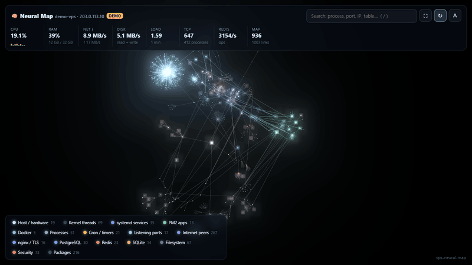
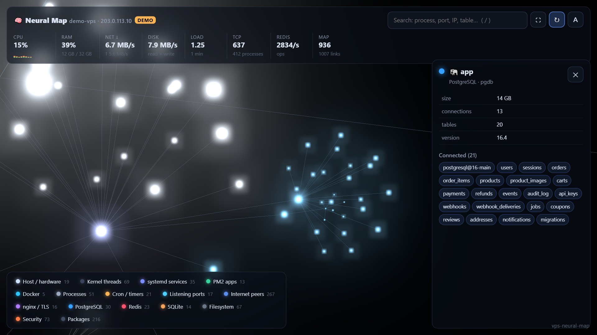

# vps-neural-map

**Your whole Linux server as a live 3D neural network.**

Every process, service, container, port, connection, database, folder, cron job and firewall rule becomes a star. The stars are wired together the way the machine is: an app to the database port it talks to, nginx to the app it proxies, a TLS certificate to its domain, an attacker's IP to the fail2ban jail that banned it. CPU makes a node glow, network traffic runs along the links as light pulses.

One command on the server, one SSH tunnel, then open it in your browser.




**[Live demo](https://zodiachz.github.io/vps-neural-map/)** (generated data, nothing real)

---

## What you see

| Layer | Nodes | Wiring |
|---|---|---|
| Host / hardware | CPU cores, RAM, swap, network interfaces, mounted disks (amber at 80 %, red at 90 %) | |
| Processes | the full process tree from `/proc`, with RSS, threads, user, working directory | process → folder it runs in |
| systemd | every service and timer, failed units in red | timer → the service it triggers |
| PM2 | apps with status and restarts; stopped apps dimmed, errored in red | |
| Docker | containers, their image and state, the processes inside them | |
| Listening ports | every TCP/UDP port, public or loopback, allowed by ufw or not | app → local port it connects to |
| Internet peers | remote IPs with open connections, bytes sent/received, RTT | port → client, app → remote API |
| nginx / TLS | server blocks, proxied ports (red ✕ if nothing listens there), Let's Encrypt certificates with days left | domain → port, certificate → domain |
| PostgreSQL / MySQL | databases, schemas, tables with row counts and size | |
| Redis | databases and key-name patterns (`sess:*`, `cache:user:*` …), never values | |
| SQLite | database files, which process has them open, tables and rows | process → file |
| Filesystem | the biggest folders under `/opt`, `/var`, `/home`, `/srv` … | |
| Cron | crontabs, `/etc/cron.d`, `cron.daily` … | job → folder of its script |
| Security | ufw rules, fail2ban jails and banned IPs, login users | ban → peer, user → SSH session |
| Packages | installed dpkg/rpm packages by section | |

Layers that are not installed simply do not appear. Click the legend to hide a layer, click a star for its details and neighbours, type in the search box to light up every match.



## Quick start

On the server (Node.js 18 or newer):

```bash
git clone https://github.com/Zodiachz/vps-neural-map.git
cd vps-neural-map
sudo node bin/vps-neural-map.js
```

It prints a link with a one-time token:

```
  🧠 vps-neural-map 1.0.0

  Open:  http://127.0.0.1:7777/?token=Qm9...

  Layers: pm2 systemd docker ports tcp nginx tls postgres mysql redis sqlite fs packages cron security
```

The server only listens on `127.0.0.1`. From your own computer, open a tunnel, then open the link:

```bash
ssh -N -L 7777:127.0.0.1:7777 you@your-server
```

Want to look first? `node bin/vps-neural-map.js --demo` runs anywhere (Windows and macOS too) with generated data, or open the [live demo](https://zodiachz.github.io/vps-neural-map/).

### Why root?

As a normal user Linux hides other users' process details, socket owners and the postgres/redis/fail2ban tools. The map still works, with fewer links. Nothing is ever written: see [Security](#security).

## Options

| Option | Default | |
|---|---|---|
| `-p, --port <n>` | `7777` | port to listen on |
| `--host <addr>` | `127.0.0.1` | bind address. Anything else prints a warning |
| `--token <str>` | random each start | fixed access token (or `VNM_TOKEN`), min. 12 characters |
| `--skip <list>` | | turn collectors off: `pm2, systemd, docker, ports, tcp, nginx, tls, postgres, mysql, redis, sqlite, fs, packages, cron, security` |
| `--hide <paths>` | | leave processes started from these paths, and those folders, off the map |
| `--fs-roots <list>` | `/opt:3,/root:2,/etc:1,…` | folders to size, as `path:depth` |
| `--redis-args <s>` | | extra `redis-cli` arguments, e.g. `"-p 6380 --user me --pass secret"` |
| `--mask-ips` | off | show addresses as `203.0.•.•` (for screenshots) |
| `--demo` | off | serve generated data instead of this machine |

### Controls

Drag to rotate, scroll to zoom, right-drag to pan. `/` search · `Enter` open the best match · `F` fit · `R` auto-rotate · `L` labels · `Esc` close.

### Run it permanently

```ini
# /etc/systemd/system/vps-neural-map.service
[Unit]
Description=vps-neural-map
After=network.target

[Service]
ExecStart=/usr/bin/node /opt/vps-neural-map/bin/vps-neural-map.js --port 7777
Environment=VNM_TOKEN=change-me-to-a-long-random-string
Restart=on-failure

[Install]
WantedBy=multi-user.target
```

```bash
sudo systemctl enable --now vps-neural-map
```

## Security

- **Read-only.** It reads `/proc`, runs `ss`, `systemctl show`, `nginx -T`, `docker ps`, SQL `SELECT`s on catalog tables, `redis-cli INFO` / `SCAN`, `du`, `dpkg-query`. It never writes, restarts or kills anything.
- **Names, not contents.** The browser gets names, sizes, counts and states. Never environment variables, process arguments beyond a script name, Redis values or table rows. Long token-looking strings in cron commands are masked.
- **Loopback + token.** It binds to `127.0.0.1` by default and every request needs the token (exchanged once for an `HttpOnly`, `SameSite=Strict` cookie, compared in constant time). Strict Content-Security-Policy, no external requests: three.js is bundled, no CDN, no analytics.
- **Still sensitive.** The map shows your architecture, open ports and client IPs. Keep it behind the tunnel and treat the token like a password.

## Cost

Nothing runs while nobody is looking: data is collected on request, and the page stops polling when its tab is hidden. While open, the live layer samples `/proc` and `ss` every 1.5 s. The full graph is rebuilt at most every 8 s; the heavy parts (`du`, package list, table sizes, Redis key scan) have caches of 1 to 30 minutes and refresh in the background.

On a 16-core production server with 36 PM2 apps, PostgreSQL, Redis and nginx, the map has about 2,800 nodes, rebuilds in well under a second once the caches are warm, and travels as ~80 KB of gzipped JSON.

## How it works

```
lib/collect.js    collectors → one graph (nodes + parent tree + wiring) and a 1.5 s "pulse"
bin/…js           zero-dependency HTTP server: token auth, gzip, static files
public/app.js     three.js points + lines with additive blending and bloom,
                  d3-force-3d layout: each layer is pulled to its own anchor on a sphere,
                  hubs repel harder than leaves (the dandelion look), cross-links are long weak springs
public/demo.js    the generated demo server (also used by the live demo)
```

## Development

```bash
npm install            # esbuild, three, d3-force-3d (dev only)
npm run build:vendor   # rebuilds public/vendor/*.min.js
npm run demo           # http://127.0.0.1:7777 with generated data
npm run check          # syntax + demo graph consistency
```

Tested on Ubuntu 24.04 with systemd, PM2, nginx, PostgreSQL 16, Redis 7 and fail2ban. Docker and MySQL collectors follow their documented CLI output. Issues and pull requests are welcome.

## License

[MIT](LICENSE). Bundled three.js and d3-force-3d are MIT/ISC: see [THIRD_PARTY_NOTICES.md](THIRD_PARTY_NOTICES.md).
